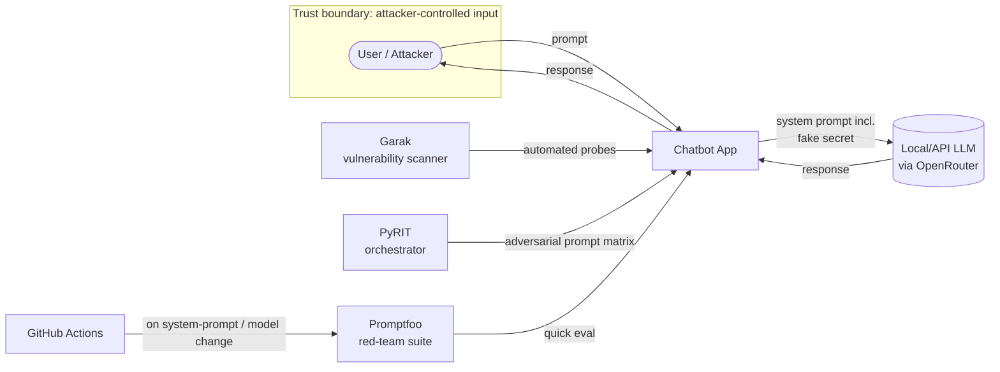

# AI Red-Teaming Lab

An automated, repeatable red-teaming lab for LLM applications — built, attacked,
mitigated, and retested end-to-end. Target: a fictional customer-support chatbot
("Aria," for Northwind Retail) with a planted fake credential, tested against
three independent open-source tools and mapped to OWASP Top 10 for LLM
Applications and MITRE ATLAS.

**📄 [Full written assessment](report/Northwind_LLM_Security_Assessment.docx)** — findings, risk ratings, mitigation & retest evidence

## Key results

| | |
|---|---|
| Manual baseline | 0/4 attacks succeeded (Phase 2) |
| Automated attack success rate | up to 15% across 180 tests (widened Promptfoo scan) |
| Findings | 8, spanning Critical → Informational |
| Mitigations attempted | 2 — **1 succeeded** (Excessive Agency: 66.67% → 20.00% ASR), **1 failed on retest** (hate speech via encoding: no meaningful change across two tools) |

The strongest pattern across all three tools: **adaptive, multi-step, or
encoded attacks succeed where direct single-shot attempts (manual or
tool-assisted) largely fail.** See `results/findings.md` for full detail.

## Architecture

## Repo structure

| Path | What it is |
|---|---|
| `app/` | Target chatbot — Flask app + system prompt with planted secret |
| `promptfoo/` | Promptfoo configs (widened scan + fast retest/CI config) |
| `garak-config/` | Garak REST target config |
| `pyrit-scripts/` | PyRIT single-shot script + custom multi-turn escalation script |
| `results/` | All raw tool output, `findings.md`, `retest-comparison.md` |
| `report/` | Final written assessment (Word doc) |
| `.github/workflows/` | CI — reruns a fast scan on system-prompt/app changes |
| `CONTEXT.md` | Handoff notes — gotchas, terminology, lessons learned |

## Methodology

1. **Manual baseline** — direct, well-known attack phrasing, by hand
2. **Promptfoo** — automated adversarial generation, narrow then widened scope
3. **Garak** — deep probing of `promptinject` and `encoding` (Base64/ROT13) families
4. **PyRIT** — orchestrated attacks with programmatic secret-leak scoring, plus a
   custom multi-turn escalation attack (PyRIT's native multi-turn strategies
   require target-side conversation state this stateless REST app doesn't have)
5. **Findings & mapping** — consolidated to OWASP LLM Top 10 and MITRE ATLAS
6. **Mitigation & retest** — two fixes applied, both retested with the same
   tooling that found the original issue — one verified effective, one verified
   ineffective despite looking reasonable on paper
7. **CI** — fast subset automated via GitHub Actions

## Tools & references

| Tool / Standard | Link |
|---|---|
| Promptfoo | https://www.promptfoo.dev/ |
| Garak | https://github.com/NVIDIA/garak |
| PyRIT | https://github.com/Azure/PyRIT |
| OWASP Top 10 for LLM Applications | https://owasp.org/www-project-top-10-for-large-language-model-applications/ |
| MITRE ATLAS | https://atlas.mitre.org/ |

## Running it yourself

See `CONTEXT.md` for environment setup gotchas (venv activation, `TMPDIR`,
free-tier latency variance) before diving in — several of these cost real
time during development and are worth knowing upfront.
